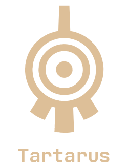
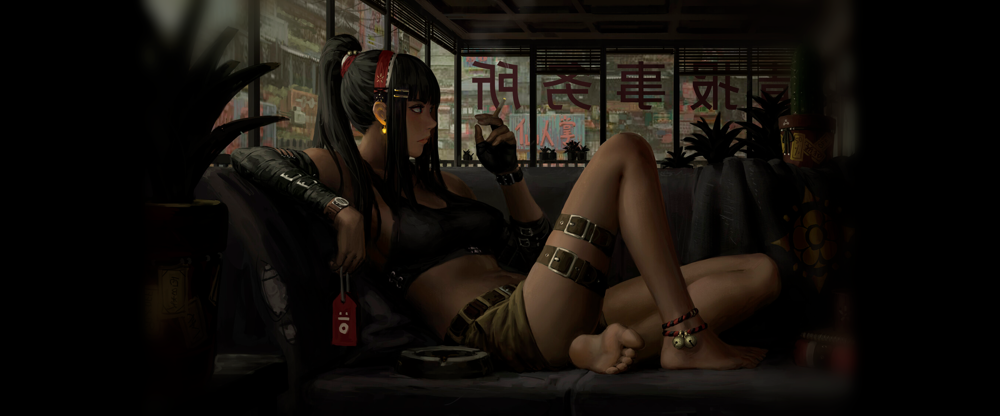
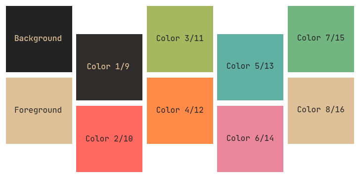
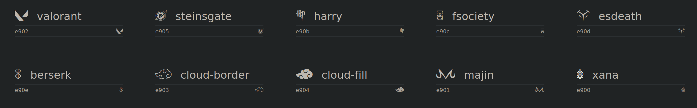
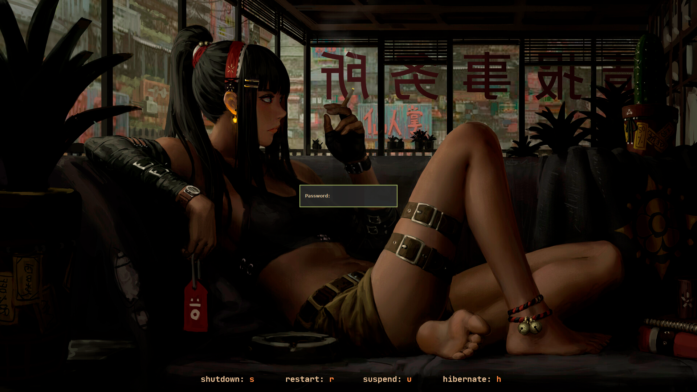
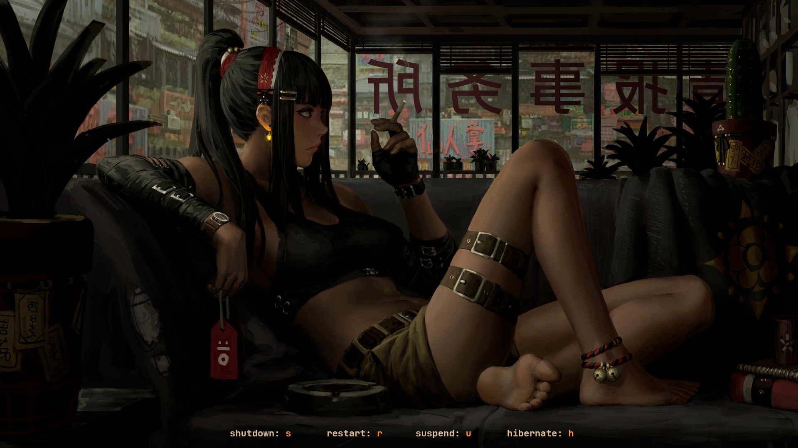
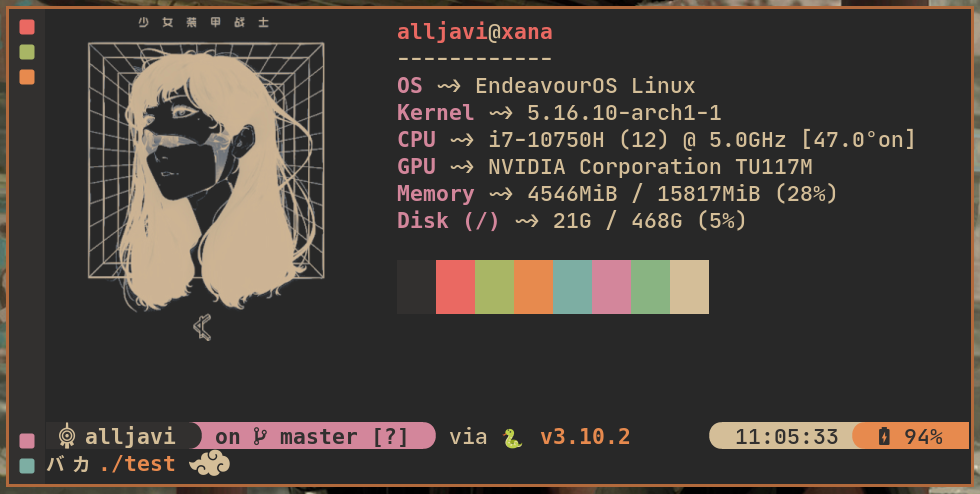
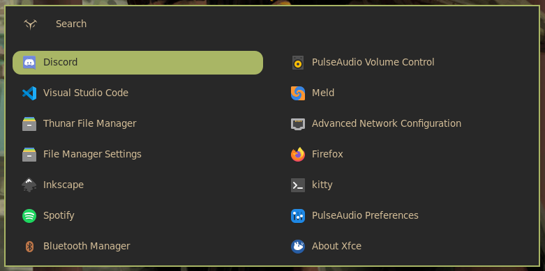
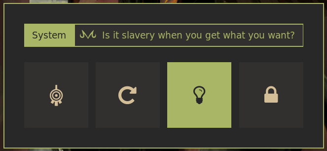

<div id="header" align='center'>
    
</div>
<div id="header" align='center'>
    <a href="https://github.com/AllJavi/tartarus-dotfiles/stargazers">
        
    </a>
    <a href="https://github.com/AllJavi/tartarus-dotfiles/issues">
        
    </a>
    <a href="https://github.com/AllJavi/tartarus-dotfiles/network/members">
        
    </a>
    <a href="https://github.com/AllJavi/tartarus-dotfiles/blob/main/LICENSE">
        
    </a>
</div>

## ScreenShots
<div align="center">
  
  
  
</div>

## Table of Contents

- [ScreenShots](#screenshots)
- [Table of Contents](#table-of-contents)
- [General Information 💻](#general-information-)
- [Hardware specs ⚙️](#hardware-specs-️)
- [Important Message](#important-message)
- [Wallpapers 🌃](#wallpapers-)
  - [Guweiz: Artstation](#guweiz-artstation)
- [Color Theme 🖌](#color-theme-)
  - [Material Gruvbox](#material-gruvbox)
- [Fonts 🖋](#fonts-)
  - [JetBrains Mono Nerd Font: Nerd Fonts](#jetbrains-mono-nerd-font-nerd-fonts)
  - [Custom Icomoon Font: Icomoon](#custom-icomoon-font-icomoon)
- [LightDM Mini Greeter 🔒](#lightdm-mini-greeter-)
- [Awesome 🪄](#awesome-)
  - [Requirements](#requirements)
  - [Useful Shortcuts](#useful-shortcuts)
  - [Recomendations](#recomendations)
- [Starship 🚀](#starship-)
- [Rofi Launcher 📤](#rofi-launcher-)
- [Rofi Power Menu🔋](#rofi-power-menu)
- [Rofi Network Menu 📡](#rofi-network-menu-)
- [Spicetify 📻](#spicetify-)
- [BetterDiscord](#betterdiscord)
- [Firefox StartPage 🏠](#firefox-startpage-)
- [Inspired by 🪐](#inspired-by-)

## General Information 💻
- **OS:** EndeavourOS
- **Wallpapers:** Guweiz
- **Color Theme:** Material Gruvbox
- **Fonts:** JetBrains Mono Nerd Font, Custom Icomoon Font
- **Session Manager:** LightDM
- **LightDM Theme:** lightdm mini greeter
- **WM:** AwesomeWM
- **Compositor:** Picom
- **Terminal:** Kitty
- **Shell:** Fish
- **Fish Theme:** Starship
- **Application Launcher:** Rofi
- **Power Menu:** Rofi
- **Network Menu:** Rofi
- **Pdf Reader:** Zathura
- **Code Editor:** vscode
- **Spicetify:** Fluent
- **Discord:** BetterDiscord
- **Search Engine:** Firefox
- **Firefox HomePage:** PrettyCofee

## Hardware specs ⚙️
This is mentioned becouse I have a couple of specific configurations that only work with my computer
- **Two graphics cards (Intel integrated graphics and Nvidia external graphic card)**
- **Dual monitor setup**

**Note:** On my os configuration I only use the external graphic card

## Important Message
This dotfiles were created to use them as a base not to just copy them into your system. So make sure you deep dive in the code and customize it to your system.

## Wallpapers 🌃
### Guweiz: [Artstation](https://www.artstation.com/guweiz)
Main | Secundary
:-------------------------:|:-------------------------:
| | |
|[Original](Images/Wallpapers/main-wide.jpg)|[Original](Images/Wallpapers/secundary-wide.jpg)|

I modified these images to fit my ultrawide 21:9 screen, which messed up the borders. If you want the best quality, use the original versions of the artwork.

## Color Theme 🖌
### Material Gruvbox
<div align="center">
    
</div>

The original creators: [Material Gruvbox](https://github.com/sainnhe/gruvbox-material)

Base Xresources: [.Xresources](https://gist.github.com/Cardoso1994/5fbbf98603b44bc986ec18e607b7dbf1#file-xresources_gruvbox_material)

*This color theme is applied on all the apps I customize for this rice*

## Fonts 🖋
### JetBrains Mono Nerd Font: [Nerd Fonts](https://www.nerdfonts.com/font-downloads)
### Custom Icomoon Font: [Icomoon](./Icomoon/)
I really like to put details and reference tv shows and films I like, so I have created my own custom font with these references and I used them on the rice. You can do it too on [icomoon](https://icomoon.io/)

Preview:


You need to be careful with what nerd font you use because they can overlap between them, I have only tested with JetBrains.

The fastest way to install them is to put it on your
```~/.local/share/fonts/ttf/```
directory, as you can see on mine [./.local/share/fonts/ttf/](./.local/share/fonts/ttf/)

## LightDM Mini Greeter 🔒
Main repository: [LightDM Mini Greeter](https://github.com/prikhi/lightdm-mini-greeter)

Screenshots:
Preview | Wallpaper
:-------------------------:|:-------------------------:
|||

If you want to apply the theme just install LightDM Mini Greeter following their instractions and use the [lightdm-mini-greeter.conf](./LightDM-Mini-Greeter/lightdm-mini-greeter.conf). Make sure you change the user and the background-image route:
```
...
# The user to login as.
user = <your-username>
# Whether to show the password input's label.
show-password-label = true
...
# An absolute path to an optional background image.
# The image will be displayed centered & unscaled.
background-image = "<your-own-route>"
# The screen's background color.
background-color = "#282828"
...
```

In my personal [LightDM](./LightDM-Mini-Greeter/lightdm.conf) configuration, I have a display-setup-script that is only necessary if you need to configure your graphics drivers or screen setup. You will need to customize the script for your specific needs.

## Awesome 🪄 
### Requirements
Make sure you check or change the default apps configuration [~/.config/awesome/configuration/apps.lua](.config/awesome/configuration/apps.lua)
And if you want to use the spofify widget you need to have spotify CLI installed, it uses dbus to communicate with spotify-client:
```
git clone https://gist.github.com/fa6258f3ff7b17747ee3.git
cd ./fa6258f3ff7b17747ee3 
chmod +x sp
sudo cp ./sp /usr/local/bin/
```
### Useful Shortcuts
- **MOD + H:** To show all the shortcuts
- **MOD + Q:** Open/Close Dashboard
- **MOD + Enter:** Open Terminal
- **MOD + Shift + C:** Close Client

### Recomendations
For the dashboard I use my own custom icons and routes. Check careful the [theme file](.config/awesome/theme/default-theme.lua) and change the global routes for your own routes and use your own icons.
```
    ...
    -- User profile
    theme.user_picture = ...

    -- folder icons
    theme.code_folder = ...
    theme.design_folder = ...
    theme.teleco_folder = ...
    theme.download_folder = ...
    theme.design3d_folder = ...
    theme.shared_folder = ...
    ...
```

## Starship 🚀
[The minimal, blazing-fast, and infinitely customizable prompt for any shell!](https://starship.rs/)

Screenshot:

<div align="center">
  
</div>

If you don't want to use my own fish config make sure you launch starship in yours ```
starship init fish | source```. The only file you need to use this theme on starship is the [startship.toml](.config/starship.toml) located on ~/.config.

## Rofi Launcher 📤
Modified themes from [adi1090x/rofi](https://github.com/adi1090x/rofi) 

Screenshot:

<div align="center">
  
</div>

In my ```~/.config/rofi/``` I have all of his config and feel free to try all of his themes. The one I use and I modify is [~/.config/rofi/launchers/colorful/launcher.sh](.config/rofi/launchers/colorful/launcher.sh)

## Rofi Power Menu🔋
As the launcher I modified some themes from [adi1090x/rofi](https://github.com/adi1090x/rofi) 

Screenshot:

<div align="center">
  
</div>

This one is located on my [~/.config/rofi/applets/menu/powermenu.sh](.config/rofi/applets/menu/powermenu.sh).

## Rofi Network Menu 📡
This rofi menu is from [P3rf/rofi-network-manager](https://github.com/P3rf/rofi-network-manager). As the other ones I only have changed the theme to fit into the rice.

I put all the repo on [~/.config/rofi/rofi-network-manager](.config/rofi/rofi-network-manager/).

## Spicetify 📻
For spicetify I used the [Fluent](https://github.com/williamckha/spicetify-fluent) theme with a custom [material gruvbox](.config/spicetify/Themes/Fluent/color.ini) I made.

Screenshot:

<div align="center">
  
</div>

## BetterDiscord

Theme: 
 - [ClearVision](https://betterdiscord.app/theme/ClearVision)

Plugins:
 - [Game Activity toggle](https://betterdiscord.app/plugin/GameActivityToggle)
 - [Joined At Date](https://betterdiscord.app/plugin/JoinedAtDate)
 - [Show Hidden Channels](https://github.com/JustOptimize/return-ShowHiddenChannels)
 - [Spotify Controls](https://betterdiscord.app/plugin/SpotifyControls)

Screenshot:

<div align="center">
  
</div>

And as all the other things the theme is modified in [~/.config/BetterDiscord/themes/ClearVision_v6.css](.config/BetterDiscord/themes/ClearVision_v6.theme.css)

If you want to use the same exact theme you need to upload the secundary wallpaper and link it with the url in the css file
```
  ...
	/* APP BACKGROUND */
	--background-shading: 40%; /* app background shading (0 for complete smoothness) [default: 100%] */
	--background-overlay: rgba(40, 40, 40, 0.7); /* app background overlay color/gradient [default: rgba(0, 0, 0, 0.6)] */
	--background-image: url(<your-url>); /* app background image (link must be HTTPS) [default: url(https://clearvision.gitlab.io/images/sapphire.jpg)]*/
	--background-position: center; /* app background position [default: center] */
	--background-size: cover; /* app background size [default: cover] */
	--background-repeat: no-repeat; /* app background repeat [default: no-repeat] */
  ...
``` 

## Firefox StartPage 🏠
The start page is [Fluidity](https://github.com/PrettyCoffee/fluidity) and it's already built. You just need to set up the [new tab](https://addons.mozilla.org/es/firefox/addon/new-tab-override/) extension and link it to the live demo of the project. Meanwhile, the Firefox theme is available on the official store [Material Gruvbox](https://addons.mozilla.org/es/firefox/addon/material-gruvbox), so you can download and use it.

Screenshot:

<div align="center">
  
</div>

The theme is already available on the web, so you can just select it and fill it with the categories you want. 

## Inspired by 🪐
- [the glorious dotfiles](https://github.com/manilarome/the-glorious-dotfiles): Big inspiration and learning source for awesomeWM
- [purhan/dotfiles](https://github.com/purhan/dotfiles): Really big learning source for awesomeWM (just simpler than the glorious dotfiles)
- [reddit post](https://www.reddit.com/r/unixporn/comments/jwh6fr/bspwm_aesthetic_anime/): Main visual inspiration of what I want
- [distrotube](https://distro.tube/): As a reference to compose all the system with his configuration files

<div id="header" align='center'>
  <h1>⚜️ GAME OVER ⚜️</h1>
</div>
